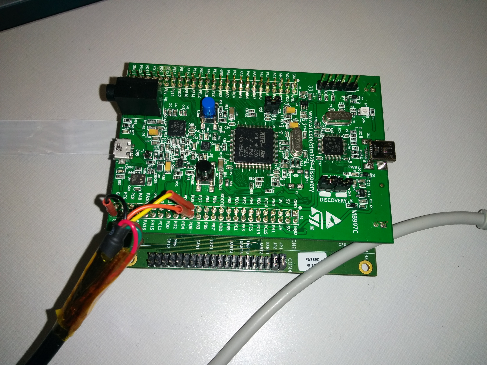
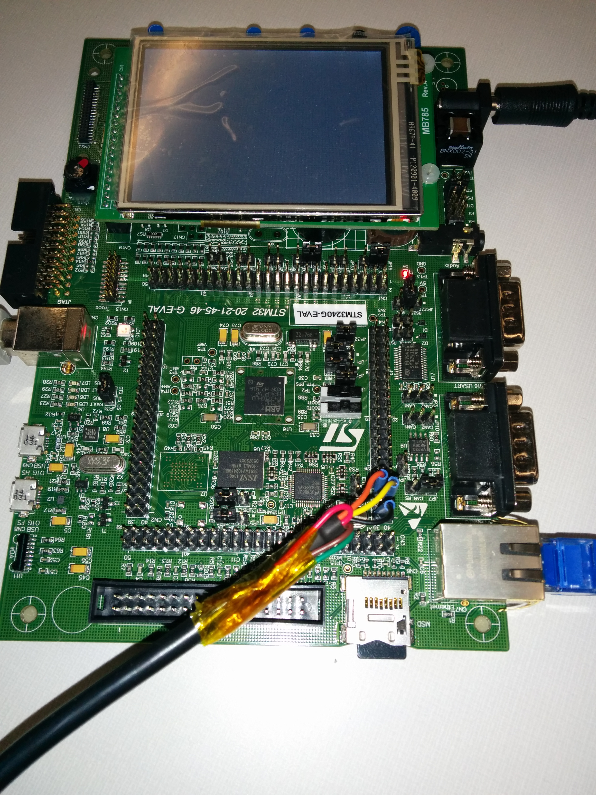

ROS 2.0 NuttX prototype
-------------

This repository prototypes ROS 2.0 for embedded systems using NuttX, Tinq and the STM32F4 IC.

- [Milestones](#milestones)
- [Hardware](#hardware)
    + [STM32F4Discovery](#stm32f4discovery-board)
    + [STM3240G-eval](#stm3240g-eval)
- [Setting it up](#setting-it-up)
    + [Installing menuconfig](#installing-menuconfig)
    + [Installing the code](#installing-the-code)
    + [Selecting a configuration](#selecting-a-configuration)
    + [Building](#building)
    + [Programming](#programming)
    + [Serial console](#serial-console)
    + [Modifying NuttX](#modifying-nuttx)
    + [Debugging](#debugging)
    + [Rebasing NuttX](#rebasing-nuttx)
    + [Memory inspection](#memory-inspection)
- [Threading](#threading) 
- [Running in Linux](#running-in-linux)
- [File structure](#file-structure)
- [DDS Debug Shell](#dds-debug-shell)
- [ROS Client Library (wip)](#ros-client-library)
    + [Applications](#applications)
- [Communication](#communication)
- [Limitations](#limitations)


 The prototype has been built in a modular way using the following blocks:

```
                                        
                              ......    
.....   .....   .....     ............. 
....'  ......  .......    ...       ....
....     ...     ...                 ...
                                    ....
.....  ......   .....             ..... 
.....  ......  .......           .....  
                              ......    
  .                          .....      
.....  ......  ......      ......       
.....  .....'  ......     ..............
.                                      .
                                        

----------------------------------
|           application           |
----------------------------------
|               rcl               |
----------------------------------
|            DDS (Tinq)           |
----------------------------------
|          RTOS (NuttX)           |
__________________________________

|        Hardware (STM32F4)       |
----------------------------------

```

### Milestones

- [x] Quick overview/understand fo the OMG DDS standart 
- [x] Evaluate different Open Source DDS implementations and select one meant for embedded devices (Tinq selected)
- [x] Prototype with [FreeRTOS](https://github.com/ros2/ros2_embedded_freertos) (discarded)
- [x] Prototype with [Riot](https://github.com/ros2/ros2_embedded_riot) (discarded)
- [x] Prototype with NuttX (current prototype)
- [x] Use the network stack to create a simple UDP/IP example over Ethernet
- [x] NSH (NuttX Shell) infraestructure set up
- [x] Adjust DDS interfaces to match with NuttX (pseudo-POSIX)
- [x] DDS compiling and linking on top of NuttX
- [x] Code small enough to fit in RAM and ROM (refer to [this discussion](https://github.com/brunodebus/tinq-core/issues/7#issuecomment-63401794) for an approximate size of RAM, current ROM image is about 700 KB)
- [x] DDS chat application running
- [x] DDS Debug Shell available
- [x] Tinq-embedded <-> Tinq Desktop interoperability (DDS embedded - DDS Desktop)
- [x] DDSIMU demo using ChatMsg type (Tinq Desktop to Tinq Embedded using the same DDS type)
- [x] Tinq Desktop <-> OpenSplice Desktop interoperability 
- [x] Tinq Embedded <-> OpenSplice Desktop interoperability
- [x]  [DDSAccel](https://github.com/ros2/ros2_embedded_nuttx/wiki/DDSAccel-demo-(Vector3-ROS-type-Desktop---Embedded)) demo using a ROS [Vector3](http://docs.ros.org/api/geometry_msgs/html/msg/Vector3.html) message 
- [x] [ROSIMU](https://github.com/ros2/ros2_embedded_nuttx/wiki/ROSIMU-demo-(Imu-ROS-msg-type,-lis302dlh-accel)) demo using a ROS [Imu](http://docs.ros.org/api/sensor_msgs/html/msg/Imu.html) message
- [ ] rcl embedded
- [ ] create `ros2_middleware_tinq`
- [ ] Hardware frontier


###Hardware
####STM32F4Discovery board
Initially we kicked off the prototype with the `STM32F4Discovery board` together with the `STM32F4-BB` (this daugher board provides Ethernet). The board is connected to the computer using USB. This connection is used to power up the board, program and debug (through STLINK). `PD5`, `PD6` and `GND` are used as the serial connection (for development and debugging purposes, NSH, etc). An Ethernet cable is connected from the `STM32F4-BB` to the working station.



The size of Tinq and NuttX together made us switch into a board with more capacity the STM3240G-eval.

####STM3240G-eval 



The STM3240G-eval board includes additional 2 MB SRAM. In order to set it up, connect the USB (flashing purposes, ST-Link), the Ethernet cable, the power connector and finally a 3.3V USB to serial cable:


The `TX`, `RX` and `GND` signals should be connected to `CN4` pins `36`, `35` and `39` respectively.


To get a serial console type:
```bash
 sudo screen /dev/ttyUSB0 115200
```

(assuming that `/dev/ttyUSB0` is the new device that appears when connecting the USB to serial cable)

###Setting it up

####Requirements
Install the following requirements:

```bash
sudo apt-get install libssl-dev libxml2-dev pkg-config picocom screen libusb-1.0-0-dev gcc-arm-none-eabi
```

##### Installing `menuconfig`
```bash
git clone http://ymorin.is-a-geek.org/git/kconfig-frontends
cd kconfig-frontends/
sudo apt-get install autotools-dev autoconf gperf flex bison libncurses5-dev libtool
./bootstrap
./configure
make
sudo make install
sudo /sbin/ldconfig -v
```

##### Installing the code
```bash
git clone https://github.com/ros2/ros2_embedded_nuttx
cd ros2_embedded_nuttx
rmdir stlink
git clone https://github.com/ros2/stlink
cd stlink
./autogen.sh
./configure
make
cd ..
```

##### Installing openocd
```bash
cd tools
make openocd
cd ..
```

##### Selecting a configuration
For Tinq the one you need to use is:
```bash
cd nuttx/tools
./configure.sh stm3240g-eval/dds
cd ..
```
(alternatively if you work with the STM32F4Discovery board do a `./configure stm32f4discovery/dds
`)

This configurations selects `apps/examples/dds` DDS application.

#####Building

```bash
cd nuttx/
make 
```


#####Programming
To program the board:
```bash
make program
```

The output should look like:
```bash
make program
../tools/openocd/bin/openocd -f board/stm32f4discovery.cfg -c "init" -c "reset halt" -c "flash write_image erase nuttx.bin 0x08000000 bin" -c "verify_image nuttx.bin 0x8000000; reset run; exit"
Open On-Chip Debugger 0.9.0-dev-00112-g1fa24eb (2014-08-19-11:23)
Licensed under GNU GPL v2
For bug reports, read
    http://openocd.sourceforge.net/doc/doxygen/bugs.html
Info : The selected transport took over low-level target control. The results might differ compared to plain JTAG/SWD
adapter speed: 1000 kHz
adapter_nsrst_delay: 100
srst_only separate srst_nogate srst_open_drain connect_deassert_srst
Info : clock speed 1000 kHz
Info : STLINK v2 JTAG v17 API v2 SWIM v0 VID 0x0483 PID 0x3748
Info : using stlink api v2
Info : Target voltage: 3.242300
Info : stm32f4x.cpu: hardware has 6 breakpoints, 4 watchpoints
target state: halted
target halted due to debug-request, current mode: Thread 
xPSR: 0x01000000 pc: 0x080004b0 msp: 0x2000ce18
auto erase enabled
Info : device id = 0x10016413
Info : flash size = 1024kbytes
target state: halted
target halted due to breakpoint, current mode: Thread 
xPSR: 0x61000000 pc: 0x20000042 msp: 0x2000ce18
wrote 655360 bytes from file nuttx.bin in 23.653700s (27.057 KiB/s)
target state: halted
target halted due to breakpoint, current mode: Thread 
xPSR: 0x61000000 pc: 0x2000002e msp: 0x2000ce18
verified 646286 bytes in 5.552209s (113.673 KiB/s)
make: [program] Error 1 (ignored)
```

##### Serial console
Using picocom:
```bash
picocom /dev/ttyUSB0 -b 115200
```
Using screen:
```bash
screen /dev/ttyUSB0 115200
```
The advantage of using picocom is that you can scroll while screen does not offer that option by default.

##### Modifying NuttX
To program the board:
```bash
make program
```

#####Debugging

```bash
cd nuttx/
make gdb_server
```
In another terminal (same directory):
```bash
make gdb
```


##### Rebasing NuttX
This prototype relies heavily on NuttX. It's recommended to rebase the code frequently with the master branch of NuttX git://git.code.sf.net/p/nuttx/git. The following steps show picture how to do it:
```bash
git remote add nuttx git://git.code.sf.net/p/nuttx/git
git fetch nuttx
git checkout master
git rebase nuttx/master
```

##### Memory inspection
We can review the memory consumed by the compiled image by:
```bash
cd nuttx
source tools/showsize.sh nuttx
```

### Threading

As it's implemented in this prototype, an application has at least 6 threads:
- [dds_thread_core](https://github.com/ros2/ros2_embedded_nuttx/blob/master/dds/src/dds/dds.c#L961): thread taking care of having a Domain Participant up and handling all the DDS core aspects
- [A thread for each locator (4)](https://github.com/ros2/ros2_embedded_nuttx/blob/master/dds/src/rtps/rtps_main.c#L851): This prototype includes a udp pseudo-poll implementation that uses a thread continuosly receiving on each locator (asociated with a file descriptor). The content is stored in a ringbuffer and fetched from the `dds_thread_core` thread. 
- application threads: each application can launch its own threads using the NuttX primitives. E.g.: [ROSIMU demo](https://github.com/ros2/ros2_embedded_nuttx/wiki/ROSIMU-demo-(Imu-ROS-msg-type,-lis302dlh-accel)) uses two more threads.

### Running in Linux
NuttX includes a simulator that allows to run the applications (with some resctrictions, refer to [nuttx/configs/sim/README.txt](nuttx/configs/sim/README.txt)) directly in Linux. A simple setup can be achieved through:
```
cd nuttx
make distclean # this is an important step to clean previous builds
cd tools
./configure.sh sim/nsh # make sure you have all the requirements in your Linux machine before compiling (e.g. zlib installed, ...)
cd -
make
./nuttx # you should see the NuttX shell ;)
```

---

*IGMPv2*

NuttX supports only IGMPv2 thereby in order to put force your Linux machine in this mode the following should
be done:
```bash

sudo bash
echo "2" > /proc/sys/net/ipv4/conf/eth0/force_igmp_version
```
If you wish to set if to the default value:
```bash
sudo bash
echo "0" > /proc/sys/net/ipv4/conf/eth0/force_igmp_version
```

---


### File structure

```bash
tree -L 1
.
├── apps
├── tinq-core
├── misc
├── nuttx
├── NxWidgets
├── rcl
├── README.md
├── ros2_embedded.sublime-project
├── ros2_embedded.sublime-workspace
├── ros2_embedded.tmLanguage
├── stlink
└── tools

```

- **apps**: NuttX applications. The subdirectory `examples` contains some of the DDS apps.
- **tinq-core**: Tinq's DDS implementation hacked to work with NuttX.
- **misc**: Variety of things.
- **nuttx**: The NuttX RTOS.
- **NxWidgets**: a special graphical user interface.
- **rcl**: ROS 2 Client Library (Ros Client Library) for embedded.
- **README.md**: this file.
- **ros2_embedded.\***: Sublime text configuration files.
- **stlink**: a modified version of stlink compatible with the implementations.
- **tools**: a set of useful tools for development.


### DDS Debug Shell

[Tinq's]() DDS implemmentation comes together with a `DDS Debug Shell` that has proved to be terribly useful to debug problems when working with DDS. The shell can be used prepending `!!` to any of the available commands:

```bash
!!help
Following commands are available:
    ssys                  Display system-specific data.
    stimer                Display the timers.
    sstr                  Display the string cache.
    spool                 Display the pools.
    spoola                Display the pools (extended).
    scx [<cx>]            Display connections.
    scxa [<cx>]           Display connections (extended).
    scxq                  Display queued connections.
    sloc                  Display locators.
    sconfig               Display configuration data.
    sdomain <d> <lf> <rf> Display domain (d) info.
                          <lf> and <rf> are bitmaps for local/remote info.
                          1=Locator, 2=Builtin, 4=Endp, 8=Type, 10=Topic.
    sdisc                 Display discovery info.
    sdisca                Display all discovery info (sdisc + endpoints)
    stype [<name>]        Display Type information.
    sqos                  Display QoS parameters.
    stopic <d> [<name>]   Display Topic information.
    sendpoints            Display the DCPS/RTPS Readers/Writers.
    scache <ep>           Display an RTPS Endpoint Cache.
    sdcache <ep>          Display a DCPS Endpoint Cache.
    qcache <ep> [<query>] Query cache data of the specified endpoint:
                          where: <ep>: endpoint, <query>: SQL Query string.
    sproxy [<ep>]         Display Proxy contexts.
    rproxy [<ep>]         Restart Proxy context.
    seqos <ep>            Display endpoint QoS parameters.
    scrypto <ep>          Display entity crypto parameters.
    sscache               Display security cache.
    rehs                  Request a rehandshake.
    srx                   Display the RTPS Receiver context.
    stx                   Display the RTPS Transmitter context.
    sfd                   Display the status of the file descriptors.
    asp <d>               Assert participant.
    ase <ep>              Assert writer endpoint.
    dtls                  Display DTLS connection related info.
    spdb                  Display the policy database.
    sfwd                  Display the forwarder state.
    ftrace <n>            Start forwarder tracing for <n> events.
    d [<p> [<n>]]         Dump memory.
    da [<p> [<n>]]        Dump memory in ASCII.
    db [<p> [<n>]]        Dump memory in hex bytes.
    ds [<p> [<n>]]        Dump memory in hex 16-bit values.
    dl [<p> [<n>]]        Dump memory in hex 32-bit values.
    dm [<p> [<n>]]        Dump memory in mixed hex/ASCII.
    indent <tab> <n>      Set indent type (if <tab>=1: use TABs).
    taflags <flags>       Set type attribute display flags.
                          <flags>: 1=header, 2=size, 4=elsize, 8=ofs.
    server [<port>]       Start debug server on the given port.
    env                   Display configuration data (=sconf).
    set <var> <value>     Set the configuration variable to given value.
    unset <var>           Unset the configuration variable.
    suspend <value>       Suspend with given mode.
    activate <value>      Activate with given mode.
    help                  Display general help.
    exit                  Close remote connection.

```

### ROS Client Library
The [ROS Client Library](rcl/README.md) (rcl) for embedded (implemented under the `rcl` directory) allows to code ROS applications using the ROS 2 API. Refer to [rcl.h](rcl/rcl.h) for a list of functions.

A simple ROS publisher can be coded with:
```c
#include "rcl.h"

int ros_main(int argc, char *argv[])
{
    /* Init the ROS Client Library */
    rcl_init();
    
    /* Create a ROS node */
    create_node();

    /* Init the dynamic types 
        TODO: abstract this code
    */
    init_types();

    /* Create a publisher
        TODO: specify message types, topics, etc.
    */
    create_publisher();

    int i;
    for (i=0; i<10; i++){
        publish("Hola ROS 2, ¿como estás?");
    }
}
```

Refer to the [rcl/README.md](rcl/README.md) for further instructions on how to use the ROS 2 API to code applications.

#### Applications
Applications are coded at `apps/ros`. Refer to `apps/ros/publisher` for an example.

### Communication
- [development discussion](https://github.com/brunodebus/tinq-core/issues/7)

### Limitations

- Current example applications (e.g. the [ROSIMU](https://github.com/ros2/ros2_embedded_nuttx/wiki/ROSIMU-demo-(Imu-ROS-msg-type,-lis302dlh-accel)) demo) publish at about 3 Hz. The reason behind this matter is the 4 threads (one for each locator blocked in a `recvfrom` call) simulating UDP polling (refer to [threading](#threading)). Without these 4 threads (which are needed for DDS communication), the code has proved to be able to publish at up to 50 Hz. This limitation should be address by implementing real UDP `poll()` or `select()` support. Refer to [nuttx official repository/TODO](http://sourceforge.net/p/nuttx/git/ci/master/tree/nuttx/TODO), particularly the `UDP READ-AHEAD?` and `NO POLL/SELECT ON UDP SOCKETS` tickets.
- Reception of packages: As mentioned before, this prototype implements UDP `poll()` using 4 threads (one for each locator) blocked "reading" all the time. If a package arrives and there's nobody reading (the corresponding thread should be scheduled at that time) then the kernel dumps the package. This causes that only "some packages" coming from the publising side will be received and processed properly. This [log](https://gist.github.com/vmayoral/703711a6828105cd34bf) presents the `rosimu_subscriber` application running in the embedded board and receiving packages from the Desktop (running OpenSplice). The `header.seq` should increment by one every time however we are getting `4`, `11`, `19`, `28`, ... 
- Tinq QoS parameters hasn't been tested. There's no guarantee that it'll work.
- In NuttX we can't simultaneously read and write from a socket (refer to https://github.com/brunodebus/tinq-core/issues/7#issuecomment-62443465). Tinq has been implemented with this assumption in mind thereby a set of fixes were applied to make it work.
- The implementation does not support different message types with the same topic name ([issue](https://github.com/ros2/ros2_embedded_nuttx/issues/27)). Refer to the [discussion](https://github.com/brunodebus/tinq-core/issues/7#issuecomment-62636116).
- Tinq implementation does not interoperate with RTI's Connext. Refer to the [issue](https://github.com/ros2/ros2_embedded_nuttx/issues/26).

 

